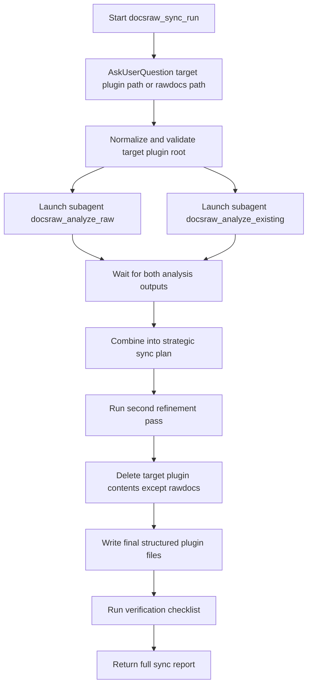

# clankgster-rawdocs Implementation Plan

## Goal

Create a new source-pathway plugin at [.clank/plugins/clankgster-rawdocs](.clank/plugins/clankgster-rawdocs) that enables users to dump unstructured content into `rawdocs/` and run a structured sync workflow that:

- treats `rawdocs/` content as the source of truth,
- preserves/evolves the rest of plugin structure thoughtfully,
- never links to `rawdocs/` from normal plugin pathways,
- and never modifies `rawdocs/` during sync.

## Workflow Design (docsraw-sync-run)

## Detailed Execution Plan

### Phase 1: Bootstrap plugin skeleton and metadata

- Create `clankgster-rawdocs` plugin root and baseline folders/files.
- Mirror manifest shape from capo, with plugin-specific name/description/keywords.
- Add a README that defines purpose, boundaries, skills, and dependency on capo.
- Ensure naming conventions are explicit for this plugin (since capo’s internal prefixes are capo-specific).

### Phase 2: Encode hard boundaries and non-negotiables

- Add hard boundary rule that no plugin file outside `rawdocs/` may link to `rawdocs/`.
- Add explicit “do not modify/delete rawdocs” protections except user-managed changes.
- Add rule text that repeated reminders about `rawdocs/` exclusion are intentional and required, not redundant.

### Phase 3: Implement `docsraw-analyze-raw`

- Scope to target plugin `rawdocs/` only (recursive), never reading siblings.
- Ignore non-text/binary files.
- Include required sub-steps:
  - reference capo write guidance
  - read raw docs, infer themes/objectives
  - capture writing style/tone/conventions
  - web research analogous plugin/theme patterns
  - analyze organization strategy with low-creativity/high-fidelity transfer intent
- Output must be extensive and structured for downstream merge use.

### Phase 4: Implement `docsraw-analyze-existing`

- Scope to target plugin excluding `rawdocs/` entirely.
- Build recursive sitemap and high-level structure map.
- If effectively empty/new (outside `rawdocs/`), return explicit `New and or empty` status and skip deeper read.
- Otherwise capture style/structure continuity signals and file-purpose outlines while minimizing specific text carryover.
- Output must be extensive and structured for downstream merge use.

### Phase 5: Implement `docsraw-sync-run` orchestrator

- Gate input first with AskUserQuestion resource.
- Normalize either user-provided plugin path or `rawdocs/` path into a canonical target plugin root.
- Launch `docsraw-analyze-raw` and `docsraw-analyze-existing` as isolated sub-agents in parallel.
- Wait for both full outputs; no overlap in analysis scope.
- Combine outputs into single strategic plan:
  - content source-of-truth from rawdocs analysis
  - structural continuity guidance from existing analysis
  - continuity over time + controlled evolution/scaling decisions
- Run required second refinement pass focused on continuity, style preservation, and structural scalability.
- Execute safe replacement:
  - remove everything in target plugin except `rawdocs/`
  - write new structured output from refined plan
- End with verification and comprehensive report.

### Phase 6: Write deep internal documentation

- Create very detailed internal planning notes in `docs/rawdocs-internal-planning-notes.md`.
- Include:
  - full concept framing,
  - rationale for hard boundary,
  - detailed step intent,
  - failure modes and guardrails,
  - why repeated exclusion instructions are mandatory,
  - continuity-vs-evolution strategy,
  - near-verbatim transcript of user instructions with only minor spelling/grammar cleanups.

### Phase 7: Validation pass

- Validate all internal markdown links.
- Validate skill frontmatter, scope, and verification checklists.
- Confirm references to capo are intentional and minimal-exception cross-plugin links.
- Verify no rule/reference/skill/docs file links into target plugin `rawdocs/`.
- Confirm docsraw skills repeatedly enforce scope boundaries exactly as requested.

## Refinement Pass (second-pass strategic tightening)

### Refinement objectives

- Increase specificity for input normalization behavior (plugin path vs rawdocs path).
- Strengthen no-overlap guarantees for analysis responsibilities.
- Strengthen idempotence and repeat-sync continuity language.
- Strengthen deletion safeguards to avoid accidental `rawdocs/` removal.
- Expand reporting contracts so sub-agent outputs are complete, not summarized.

### Refinement edits to apply while implementing

- Add explicit “Scope Guard” section to each docsraw skill with positive and negative examples.
- Add explicit “Not Allowed” section listing prohibited behavior (especially touching/linking `rawdocs/` outside allowed contexts).
- Add explicit output schemas (headings/checklists) for both analysis skills to force comprehensive downstream consumption.
- Add explicit style-preservation checklist (tone, headings, quote style, habits, cadence).
- Add explicit merge arbitration guidance for conflicts between “raw source truth” and “existing structure continuity”.
- Add explicit rollback/error behavior if either analysis sub-agent fails or returns incomplete output.

## Acceptance Criteria

- New plugin `clankgster-rawdocs` exists with manifests, README, rules, skills, references, and docs.
- `docs/rawdocs-internal-planning-notes.md` captures full internal planning and transcript as requested.
- `docsraw-sync-run`, `docsraw-analyze-raw`, and `docsraw-analyze-existing` are present and highly detailed.
- Hard boundary rule forbidding links from normal plugin files to `rawdocs/` is explicit and emphatic.
- Sync workflow preserves `rawdocs/` contents untouched while rebuilding all other plugin outputs.
- Repeated exclusion reminders are preserved as intentional requirements.

## Near-verbatim transcript appendix requirement (to include in planning notes)

- Include a “User Instruction Transcript (edited only for minor spelling/grammar)” section in [.clank/plugins/clankgster-rawdocs/docs/rawdocs-internal-planning-notes.md](.clank/plugins/clankgster-rawdocs/docs/rawdocs-internal-planning-notes.md).
- Preserve wording and intent closely, including repeated exclusion reminders.
- Only apply small corrections where needed for clarity.

## Implementation Notes

- No code/file changes are performed in this planning phase.
- Execution phase should implement files in the order: metadata/rules → analyzer skills → sync orchestrator → deep docs → validation.

