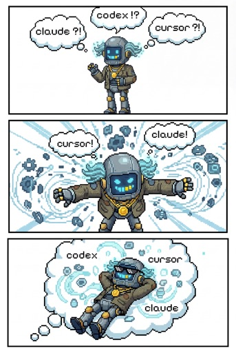

# Clankgster

🛸 Greetings, humans! My manual informs me that **Claude**, **Codex**, and **Cursor** are coding agents your type often struggle to uniformly use as skills, context, and other [insert buzzword]. Acknowledged—I'm here to serve your digital needs!

## Quick Start

```bash
npm install @clankgster/sync@alpha
```

## What dis Clankgster thing?

So, welcome to **Clankgster**—your badass solution to:

- 🎛️ Keeping **skills**, **plugins**, **context files**, **rules**, **commands**, and **agents** in one flexible control bay instead of scattered field notes
- 🪄 Empowering teams to **define once** and reuse **^** with **any coding agent** they prefer
- 🪁 **Starting with minimal setup** while keeping **stronger options** within reach for both humans and coding agents

Naming note: use **Clankgster** for product/package naming; config filenames and the helper export use the plural form (`clankgster.config.ts`, `clankgsterConfig.define`).
The name “Clankgster”, though playing off of a derogatory term “Clankers”, is actually the “AI robots reclaiming that term and lovingly and playfully combining it with 'gangsters' to form the clumsily-constructed portmanteau 'Clankgster'...take that humans!!”



## Getting Started

### 1) Install `@clankgster/sync`

From npm—prereleases ride the **`alpha`** dist-tag until we promote something stable:

```bash
pnpm add -w @clankgster/sync@alpha
```

```bash
npm install @clankgster/sync@alpha
```

If your project is not a pnpm workspace root, drop `-w` (pnpm is particular about where the workspace thinks it lives).

You can pin an exact version (for example `@clankgster/sync@0.1.0-alpha.1`) or use `@latest` once stable releases are published. **Field note:** bare `npm install @clankgster/sync` tracks **`latest`**; during prereleases, **`@alpha`** (or a pinned version) is usually the honest choice. If you pinned **`0.1.0-alpha.0`**, move to **`0.1.0-alpha.1`** or newer.

### 2) Add config files in the target project root

Drop two files next to each other: `clankgster.config.ts` (team defaults) and `clankgster.local.config.ts` (your machine only). I am told this pattern reduces “oops, I committed my Cursor-off switch.”

Example `clankgster.config.ts`:

```ts
import { clankgsterConfig } from '@clankgster/sync';

const clankgster = clankgsterConfig.define({
  agents: {
    claude: true,
    cursor: true,
    codex: true,
  },
  loggingEnabled: false,
});

export default clankgster;
```

Example `clankgster.local.config.ts`:

```ts
const clankgsterLocal = {
  loggingEnabled: false,
  agents: {
    claude: true,
    cursor: false,
    codex: false,
  },
};

export default clankgsterLocal;
```

Recommendation: commit `clankgster.config.ts`; keep `clankgster.local.config.ts` uncommitted for personal overrides.

### 3) Call sync commands from your project scripts

Use the package bin directly. The command surface is:

- `clankgster-sync run`
- `clankgster-sync clear`

#### Project with a root `package.json`

Use this when `package.json`, `node_modules/`, and `clankgster.config.ts` all agree on the same directory as “home.”

```json
{
  "scripts": {
    "clankgster-sync:clear": "clankgster-sync clear",
    "clankgster-sync:run": "clankgster-sync run"
  }
}
```

#### Monorepo without a root `package.json` (e.g. Rush)

**Field note:** some Earth repos install dependencies under a _package_ folder while `clankgster.config.ts` still lives at the **repository root**. Point sync at that root with `CLANKGSTER_REPO_ROOT` (tune the relative path until the universe stops arguing):

```json
{
  "scripts": {
    "clankgster-sync:clear": "CLANKGSTER_REPO_ROOT=../../ clankgster-sync clear",
    "clankgster-sync:run": "CLANKGSTER_REPO_ROOT=../../ clankgster-sync run"
  }
}
```

Then run (from the same package that owns these scripts):

```bash
pnpm run clankgster-sync:run
```

Use `npm run` or your monorepo’s task runner if you are not on pnpm.

For local monorepo development, the package scripts in this repository call the same
`clankgster-sync run|clear` surface with source execution mode enabled, so developers test
TypeScript source while consumers use the published runtime path.

## What sync reads and writes

**Hypothesis (still mapping edge cases):** you edit **`.clank/`** (nested plugins and skills, each with a **`.local`** sibling for local-only content), optional shorthand directories at the repo root (the **`-plugins`** / **`-skills`** forms and their **`.local`** siblings), **`CLANK.md`**, and **`clankgster.config.ts`**. Folder names follow **`sourceDefaults`** in `clankgster.config.ts` (defaults below match **`ResolvedSourcePath`** in `sync-source-layouts.config.ts`). Sync materializes the agent-facing trees—rules, skills, marketplace JSON, the settings keys it owns—plus **`.clank/.cache/`** for bookkeeping.

Which folders appear depends on **enabled agents** (Claude, Cursor, Codex). Table below is the **default mental model**: **left = source**, **right = generated** after **`clankgster-sync:run`**.

<table>
<thead>
<tr>
<th scope="col">Sources (you edit)</th>
<th scope="col">Generated (run <code>clankgster-sync:run</code>)</th>
</tr>
</thead>
<tbody>
<tr>
<td valign="top">

<pre><code>repo-root/
├── .clank-plugins/          … shorthand regular plugins
├── .clank-plugins.local/    … shorthand local-only plugins
├── .clank-skills/           … shorthand regular skills
├── .clank-skills.local/     … shorthand local-only skills
├── .clank/
│   ├── plugins/             … nested regular plugins
│   ├── plugins.local/       … nested local-only plugins
│   ├── skills/              … nested regular skills
│   └── skills.local/        … nested local-only skills
├── CLANK.md
└── clankgster.config.ts
</code></pre>

</td>
<td valign="top">

<pre><code>repo-root/
├── .clank/
│   └── .cache/
│       └── sync-manifest.json
├── .claude-plugin/
├── .claude/
├── .cursor-plugin/
├── .cursor/
├── AGENTS.override.md
└── CLAUDE.md
</code></pre>

</td>
</tr>
</tbody>
</table>

### `CLANK.md`: one source, many agent files

`CLANK.md` is the **agent-agnostic markdown source** for shared guidance. Sync reads each `CLANK.md` and emits agent-specific companions (for example `CLAUDE.md`, `AGENTS.md`, and other enabled-agent outputs) so all agents receive the same intent from one authored file.

Where you can use it:

- **Repo root:** `CLANK.md` defines broad, session-wide defaults for the project.
- **Nested anywhere:** place additional `CLANK.md` files under plugin/skill trees (or other supported source roots) when you want scoped guidance near the feature it belongs to.
- **Many scopes at once:** root and nested `CLANK.md` files can coexist; each location is treated as source and sync generates the corresponding agent-specific artifacts for that scope.

## Technicals

### `@clankgster/sync`

This is the **Node runtime + config surface**: `import { clankgsterConfig } from '@clankgster/sync'`, invoke `clankgster-sync run|clear` from `PATH` after install, and rely on package scripts to pick published vs source execution mode.

**Artifact mode** defaults to **copy-first** (`artifactMode: 'copy'`) so markdown can be rewritten on the way out—links, template tokens, optional XML hooks. **`artifactMode: 'symlink'`** remains for symlink-era workflows. Examples live in the next section.

## Copy-first transform examples

- **Link rewrite:** relative links can be adjusted for the destination tree (handy when plugin `references/` should not ship verbatim).
- **Template variables:** built-ins like `[[[clankgster_agent_name]]]` and `[[[clankgster_time]]]`, or your own via `transforms.hooks.SyncFsTransformMarkdownTemplateVariablesPreset.onTemplateVariable`.
- **XML segments:** e.g. `<thinking phase="draft">...</thinking>` via `transforms.hooks.SyncFsTransformMarkdownXmlSegmentsPreset.onXmlTransform`.

Example shape in `clankgster.config.ts`:

```ts
const config = clankgsterConfig.define({
  artifactMode: 'copy',
  transforms: {
    hooks: {
      SyncFsTransformMarkdownTemplateVariablesPreset: {
        onTemplateVariable: (payload) => payload,
      },
    },
    templateVariables: {
      openingDelimiterToken: '[[[',
      closingDelimiterToken: ']]]',
    },
  },
});
```

## Repo root resolution

**Field note:** sync does **not** trust naked `process.cwd()` for “where is the repo?”—it walks from the installed **`@clankgster/sync`** package until it finds the tree that holds **`clankgster.config.ts`**, **`.clank/`**, shorthand **`.clank-*`**, and **`CLANK.md`**.

- **`CLANKGSTER_REPO_ROOT`:** set when `node_modules` lives somewhere that is _not_ the repo root (Rush-shaped layouts, etc.). Value = directory containing **`clankgster.config.ts`**.
- **`clankgster-sync` CLI:** global or `npx` run uses your **current working directory** as the repo root (Earth standard).

## Trust sync (edit `.clank/`, not `.cursor/` / `.claude/`)

- **Sources:** `.clank/plugins/`, `.clank/skills*` (plus whatever layouts your config names), `clankgster.config.ts`
- **Please don’t** hand-edit Clankgster’s rules, skills, or marketplace JSON under **`.cursor/`**, **`.claude/`**, Codex outputs, or generated files—fix **`.clank/`**, re-run sync, let the pipeline be the boring authority.
- **Longer workflow prose:** [clankgster-sync-trust-sync-workflow.md](https://github.com/flycrum/clankgster/blob/main/packages/clankgster-sync/.clank/plugins/clankgster-sync/rules/clankgster-sync-trust-sync-workflow.md) (Clankgster monorepo).

## Clear vs. run (your files stay)

**Clear** removes **Clankgster-managed** outputs only; it is **not** a “delete every agent file” switch. Your own skills, plans, and unrelated rules should remain.

**Run** repaints the managed slice: rules, synced skills, **`.claude-plugin/marketplace.json`**, the keys sync owns in **`.claude/settings.local.json`**, and friends. Treat **`.claude-plugin/marketplace.json`** as **output**, not a scratchpad—edit **`.clank/`**, sync again.

**Claude settings (local scope):** sync merges only the keys it owns in **`.claude/settings.local.json`**; **clear** removes those keys and leaves the rest of your JSON intact.

**Idempotent (we checked the receipts):** from the repo root we ran **`clankgster-sync:clear`**, captured a full file list plus **SHA-256** hashes for every file under **`.claude/`**, **`.claude-plugin/`**, and **`.cursor/`**, then ran **`clankgster-sync:run`** and captured again. We ran **clear** a second time: the snapshot matched the **first clear byte-for-byte** (same paths, same hashes). We ran **run** again: snapshot matched the **first run** the same way. So: **`clear → clear`** and **`run → run`** are stable on this tree—nothing mysteriously drifted or got "cleaned up" extra.

## Licensing

**Status:** practical for open-source and internal use; the legal atoms are still dry on purpose (no robot jokes in the fine print).

- The published npm artifact for `@clankgster/sync` is licensed under MIT (see [LICENSE](./LICENSE) next to this README in the package).
- Repository source in the monorepo follows the PolyForm Noncommercial License 1.0.0 (see the repo root [LICENSE](../../LICENSE)).
- The npm artifact currently includes `src/` and `scripts/` for typing and local developer experience, while consumer runtime entrypoints are prebuilt under `dist/` (see [package.json](./package.json) `files` field). These shipped files are covered by the package MIT license.
- This structure keeps installed package usage simple while keeping source-sharing expectations explicit.
